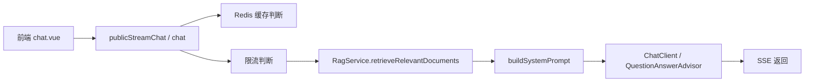
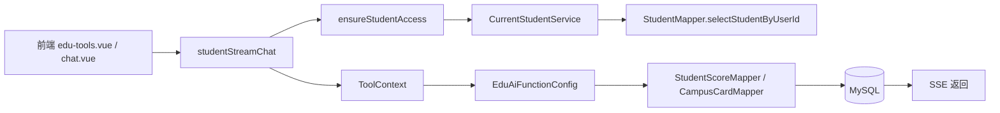
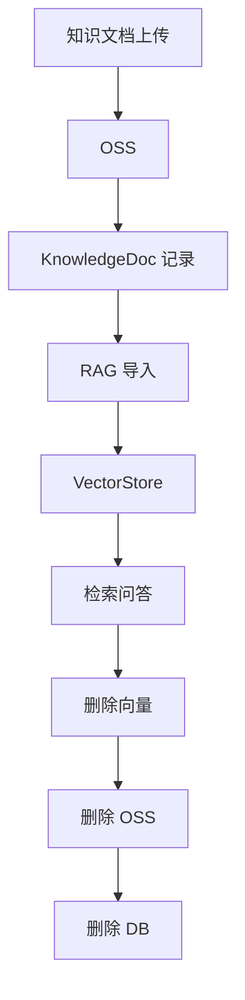

# 项目完整走读手册

说明：
- 本文基于当前代码库、`docs/`、`benchmark/`、`interview-prep/project-brief.md` 和 git 历史整理。
- 仓库内未找到 `interview-prep/resume.md` 与 `interview-prep/job.md`，所以本文不补 JD，不补个人经历，只讲代码里能确认的内容。
- 文中会区分：
  - `事实`：能直接从代码、配置、SQL、文档或 commit 证明。
  - `推断`：根据代码做出的合理判断。
  - `需要本人补充`：仓库里没有直接证据。

## 1. 先看结论

`事实`：这个项目不是一个普通聊天 demo，而是一个校园后端平台，把三类能力放在同一个系统里：
- 公共知识问答，走 RAG。
- 学生个人数据查询，走受控 Function Calling。
- 管理员全量查询，走独立后台接口。

`事实`：项目还额外包含知识库上传、向量化、删除闭环、Redis 会话记忆、SSE 流式返回、登录鉴权、操作日志、异常处理和部分限流逻辑。

`推断`：如果你从头重新理解这个项目，最重要的不是“Spring AI 怎么用”，而是先理解“为什么要把公共知识、学生隐私、管理员全量查询拆开”。

---

## 2. 建议的阅读顺序

如果你要从零重新看项目，建议按这个顺序：

1. `README.md`
2. `ruoyi-admin/src/main/java/com/ruoyi/RuoYiApplication.java`
3. `ruoyi-framework/src/main/java/com/ruoyi/framework/config/SecurityConfig.java`
4. `ruoyi-framework/src/main/java/com/ruoyi/framework/security/filter/JwtAuthenticationTokenFilter.java`
5. `ruoyi-admin/src/main/java/com/ruoyi/web/controller/system/SseChatController.java`
6. `ruoyi-system/src/main/java/com/ruoyi/system/service/RagService.java`
7. `ruoyi-admin/src/main/java/com/ruoyi/web/config/EduAiFunctionConfig.java`
8. `ruoyi-system/src/main/java/com/ruoyi/system/service/CurrentStudentService.java`
9. `ruoyi-admin/src/main/java/com/ruoyi/web/controller/system/KnowledgeDocController.java`
10. `ruoyi-system/src/main/java/com/ruoyi/system/service/impl/KnowledgeDocServiceImpl.java`
11. `ruoyi-admin/src/main/java/com/ruoyi/web/controller/system/EduApiController.java`
12. `ruoyi-admin/src/main/java/com/ruoyi/web/controller/system/AdminEduController.java`
13. `ruoyi-admin/src/main/java/com/ruoyi/web/service/RedisChatMemory.java`
14. `ruoyi-admin/src/main/java/com/ruoyi/web/config/SpringAiRedisVectorStoreConfig.java`
15. `ruoyi-framework/src/main/java/com/ruoyi/framework/web/exception/GlobalExceptionHandler.java`
16. `ruoyi-framework/src/main/java/com/ruoyi/framework/aspectj/LogAspect.java`
17. `ruoyi-framework/src/main/java/com/ruoyi/framework/aspectj/RateLimiterAspect.java`
18. `sql/ry_20260320.sql`
19. `sql/patch_student_user_binding.sql`
20. `docs/security-test.md`
21. `docs/knowledge-delete-test.md`
22. `docs/benchmark.md`

`推断`：按这个顺序看，能先建立“系统怎么跑”，再理解“为什么这么设计”，最后再看“哪里还有技术债”。

---

## 3. 仓库结构怎么理解

### 3.1 `ruoyi-admin`

`事实`：这是 Web 层和配置层，放 Controller、AI 配置、SSE、Swagger、部分 Web Service。

典型文件：
- `ruoyi-admin/src/main/java/com/ruoyi/web/controller/system/SseChatController.java`
- `ruoyi-admin/src/main/java/com/ruoyi/web/controller/system/AiController.java`
- `ruoyi-admin/src/main/java/com/ruoyi/web/controller/system/KnowledgeDocController.java`
- `ruoyi-admin/src/main/java/com/ruoyi/web/controller/system/EduApiController.java`
- `ruoyi-admin/src/main/java/com/ruoyi/web/controller/system/AdminEduController.java`
- `ruoyi-admin/src/main/java/com/ruoyi/web/config/EduAiFunctionConfig.java`
- `ruoyi-admin/src/main/java/com/ruoyi/web/config/SpringAiRedisVectorStoreConfig.java`
- `ruoyi-admin/src/main/java/com/ruoyi/web/service/RedisChatMemory.java`

### 3.2 `ruoyi-framework`

`事实`：这是横切能力层，主要是安全、过滤器、异常处理、日志、线程池、数据源等。

典型文件：
- `ruoyi-framework/src/main/java/com/ruoyi/framework/config/SecurityConfig.java`
- `ruoyi-framework/src/main/java/com/ruoyi/framework/security/filter/JwtAuthenticationTokenFilter.java`
- `ruoyi-framework/src/main/java/com/ruoyi/framework/web/exception/GlobalExceptionHandler.java`
- `ruoyi-framework/src/main/java/com/ruoyi/framework/aspectj/LogAspect.java`
- `ruoyi-framework/src/main/java/com/ruoyi/framework/aspectj/RateLimiterAspect.java`
- `ruoyi-framework/src/main/java/com/ruoyi/framework/config/ThreadPoolConfig.java`
- `ruoyi-framework/src/main/java/com/ruoyi/framework/config/FilterConfig.java`

### 3.3 `ruoyi-system`

`事实`：这是业务层和数据访问层，放实体、Mapper、Service、OSS、RAG、学生身份、知识库同步等。

典型文件：
- `ruoyi-system/src/main/java/com/ruoyi/system/service/RagService.java`
- `ruoyi-system/src/main/java/com/ruoyi/system/service/CurrentStudentService.java`
- `ruoyi-system/src/main/java/com/ruoyi/system/service/impl/KnowledgeDocServiceImpl.java`
- `ruoyi-system/src/main/java/com/ruoyi/system/Oss/AliOssService.java`
- `ruoyi-system/src/main/java/com/ruoyi/system/domain/Student.java`
- `ruoyi-system/src/main/java/com/ruoyi/system/domain/KnowledgeDoc.java`
- `ruoyi-system/src/main/java/com/ruoyi/system/domain/AiCommonQa.java`
- `ruoyi-system/src/main/resources/mapper/system/*.xml`

### 3.4 `ruoyi-ui`

`事实`：前端页面和接口封装在这里，和 AI 聊天、教育工具、知识库管理有关。

典型文件：
- `ruoyi-ui/src/views/ai/chat.vue`
- `ruoyi-ui/src/views/ai/edu-tools.vue`
- `ruoyi-ui/src/views/system/knowledge/index.vue`
- `ruoyi-ui/src/api/system/edu.js`

---

## 4. 技术栈及它们各自的作用

| 技术 | 实际作用 | 证据 |
|---|---|---|
| Java 17 | 运行时语言版本 | `pom.xml`、`ruoyi-admin/src/main/java/com/ruoyi/RuoYiApplication.java` |
| Spring Boot 3.3.3 | 应用启动、依赖装配、Controller 承载 | `pom.xml`、`RuoYiApplication.java` |
| Spring Security + JWT | 登录认证、角色鉴权、请求放行控制 | `SecurityConfig.java`、`JwtAuthenticationTokenFilter.java` |
| MyBatis + XML | 数据库访问 | `ruoyi-system/src/main/resources/mapper/system/*.xml` |
| MySQL | 业务数据存储 | `sql/ry_20260320.sql` |
| Redis | 会话记忆、问答缓存、限流、部分业务缓存 | `RedisChatMemory.java`、`AiController.java`、`SseChatController.java` |
| Spring AI | `ChatClient`、`Advisor`、Function Calling、`ChatMemory`、RAG 接入 | `AiController.java`、`SseChatController.java`、`EduAiFunctionConfig.java`、`RagService.java` |
| Redis Vector Store / SimpleVectorStore | 知识向量检索，环境不支持时回退 | `SpringAiRedisVectorStoreConfig.java` |
| TikaDocumentReader | 解析 PDF/Word/TXT/HTML 文档 | `RagService.java` |
| OSS SDK | 文档上传、下载、删除 | `AliOssService.java` |
| SSE / SseEmitter | 流式返回模型结果 | `AiController.java`、`SseChatController.java` |
| Redisson | 分布式锁、缓存防击穿场景 | `AiCommonQaServiceImpl.java` |
| Druid | 数据源连接池 | `DruidConfig.java`、`application.yml` |
| Springdoc | Swagger / OpenAPI 文档 | `SwaggerConfig.java`、`application.yml` |

`推断`：这套技术栈的核心不是“堆很多框架”，而是把 AI、权限、流式、缓存、检索、数据库、对象存储串成了一条后端链路。

---

## 5. 项目从哪里启动

`事实`：Java 启动入口是 `ruoyi-admin/src/main/java/com/ruoyi/RuoYiApplication.java#main`，类上有 `@SpringBootApplication`。

`事实`：README 里给出的启动方式是 `mvn -pl ruoyi-admin -am spring-boot:run`。

`事实`：启动时会装配很多关键 Bean，包括：
- `SecurityConfig`
- `ThreadPoolConfig`
- `SpringAiRedisVectorStoreConfig`
- `WebClientConfig`
- `RedisConfig`
- `CaptchaConfig`

`推断`：这个项目的启动难点不在“主类怎么跑”，而在配置项比较多，尤其是 Redis、OSS、AI 模型、数据库这几类外部依赖要同时可用。

---

## 6. 登录和权限的基础链路

### 6.1 登录

`事实`：常规登录链路在 `CaptchaController#getCode`、`SysLoginController#login`、`SysLoginController#getInfo`、`SysLoginController#getRouters`。

`事实`：`JwtAuthenticationTokenFilter` 负责把 token 解析成认证信息，再交给 Spring Security。

`事实`：Controller 上很多接口通过 `@PreAuthorize` 控制角色或权限。

### 6.2 角色

`事实`：项目里至少有 `student` 和 `admin` 两类核心角色。

`事实`：
- 学生个人数据接口走 `EduApiController`
- 管理员全量查询走 `AdminEduController`

`推断`：这意味着项目的安全模型不是“所有 AI 接口共用一套身份”，而是按业务入口拆开了。

---

## 7. 核心业务链路一：公共知识问答

### 7.1 这条链路解决什么问题

`事实`：校园规章制度、流程、通知这类问题，不适合让模型直接胡猜，所以要先检索再回答。

`事实`：公共问答主要入口在：
- `ruoyi-admin/src/main/java/com/ruoyi/web/controller/system/SseChatController.java#publicStreamChat`
- `ruoyi-admin/src/main/java/com/ruoyi/web/controller/system/AiController.java#chat`

### 7.2 处理流程

`事实`：`RagService` 会先从 `VectorStore` 里检索相关文档，再把检索结果注入系统提示词。

`事实`：`AiController` 和 `SseChatController` 都做了按问题短路的缓存逻辑。

`事实`：`AiController` 里还有一段 `@PostConstruct init()` 初始化的 Redis Lua 限流脚本。

`推断`：这条链路的设计重点不是“模型更聪明”，而是“尽量让答案基于校内文档并减少重复计算”。

### 7.3 关键代码

- `ruoyi-system/src/main/java/com/ruoyi/system/service/RagService.java`
- `ruoyi-admin/src/main/java/com/ruoyi/web/controller/system/SseChatController.java`
- `ruoyi-admin/src/main/java/com/ruoyi/web/controller/system/AiController.java`
- `ruoyi-admin/src/main/java/com/ruoyi/web/service/RedisChatMemory.java`

### 7.4 面试时最好怎么讲

`推断`：你可以把这条链路讲成“先查知识，再拼 prompt，再流式输出；如果命中缓存，直接短路”。这比只说“接了个大模型”更像真实工程。

---

## 8. 核心业务链路二：学生个人数据查询

### 8.1 这条链路解决什么问题

`事实`：成绩、一卡通余额这类数据属于学生个人敏感数据，不能让前端或模型随便指定 `studentId`。

`事实`：学生链路主要入口在：
- `ruoyi-admin/src/main/java/com/ruoyi/web/controller/system/SseChatController.java#studentStreamChat`
- `ruoyi-admin/src/main/java/com/ruoyi/web/controller/system/EduApiController.java`

### 8.2 处理流程

`事实`：`CurrentStudentService` 会通过 `SecurityUtils.getUserId()` 找到当前登录用户，再去查 `StudentMapper#selectStudentByUserId`。

`事实`：`EduAiFunctionConfig#getStudentScore` 和 `#getCardBalance` 的工具描述里已经明确限制，不应该由模型决定 `studentId`。

`事实`：`SseChatController` 里还有 `resolveForcedToolName` 和 `handleDirectStudentToolCall`，说明对明确意图会走单工具直达。

`推断`：这条链路的本质是“模型负责判断查什么，后端负责决定查谁”。

### 8.3 关键代码

- `ruoyi-admin/src/main/java/com/ruoyi/web/config/EduAiFunctionConfig.java`
- `ruoyi-system/src/main/java/com/ruoyi/system/service/CurrentStudentService.java`
- `ruoyi-system/src/main/resources/mapper/system/StudentMapper.xml`
- `sql/patch_student_user_binding.sql`
- `ruoyi-admin/src/main/java/com/ruoyi/web/controller/system/SseChatController.java`

### 8.4 面试时最好怎么讲

`推断`：你可以强调“学生工具链收口在后端，模型即使被 prompt 诱导，也不能改变真实身份来源”。这个点是面试官最容易追问的。

---

## 9. 核心业务链路三：管理员全量查询

### 9.1 这条链路解决什么问题

`事实`：管理员需要查询任意学生的成绩和一卡通余额，这类查询不应该走学生工具链。

`事实`：管理员入口在：
- `ruoyi-admin/src/main/java/com/ruoyi/web/controller/system/AdminEduController.java`

### 9.2 处理方式

`事实`：管理员接口直接以 `studentId` 为参数查询数据库，并通过 `@PreAuthorize("@ss.hasRole('admin')")` 限制角色。

`推断`：这是一条更“传统”的后端查询链路，和 AI 聊天链路是解耦的。

### 9.3 面试时最好怎么讲

`推断`：如果被问“为什么管理员不复用 student chat”，最稳妥的回答是：因为权限模型和使用场景完全不同，复用反而容易把边界搞乱。

---

## 10. 核心业务链路四：知识库导入、检索、删除闭环

### 10.1 导入

`事实`：知识库导入入口在：
- `ruoyi-admin/src/main/java/com/ruoyi/web/controller/system/KnowledgeDocController.java#importFile`
- `ruoyi-admin/src/main/java/com/ruoyi/web/controller/system/RagController.java#uploadAndImport`

`事实`：导入后会触发：
- `KnowledgeDocServiceImpl#asyncUploadToDifyEngine`
- `RagService#importOssFileToVectorStore`

### 10.2 删除

`事实`：删除闭环在 `RagService#deleteByFileUrl` 和 `KnowledgeDocServiceImpl#deleteSingleKnowledgeDoc` 里。

`事实`：当前实现倾向于按这个顺序收尾：
1. 删向量
2. 删 OSS
3. 删数据库记录

### 10.3 为什么顺序重要

`推断`：如果先删 DB，再删向量或 OSS，容易留下“库里没记录但外部资源还在”的残留。

`推断`：如果只按 `source/fileName` 回退，还会有同名误删风险。

### 10.4 关键代码

- `ruoyi-system/src/main/java/com/ruoyi/system/service/impl/KnowledgeDocServiceImpl.java`
- `ruoyi-system/src/main/java/com/ruoyi/system/service/RagService.java`
- `ruoyi-system/src/main/java/com/ruoyi/system/Oss/AliOssService.java`
- `docs/knowledge-delete-test.md`

### 10.5 面试时最好怎么讲

`推断`：你可以把这条链路讲成“文档不是只上传一次就结束了，它还要支持可追溯、可检索、可删除、可回收的完整生命周期”。

---

## 11. 标准问答模块：除了 AI chat，项目里还有一条普通 Q&A 线

`事实`：仓库里还有 `AiCommonQaController` 和 `AiCommonQaServiceImpl`，这条线不是大模型聊天，而是标准问答 CRUD + 缓存/锁控制。

`事实`：`project-brief.md` 里提到 `AiCommonQaServiceImpl` 使用了 Redis 和 Redisson。

`事实`：`git log` 里也能看到这块和 AI 链路一起演进。

`推断`：这条线更像“业务 FAQ 管理”，可以理解成系统里的一个辅助知识模块。

### 关键代码

- `ruoyi-admin/src/main/java/com/ruoyi/web/controller/system/AiCommonQaController.java`
- `ruoyi-system/src/main/java/com/ruoyi/system/service/impl/AiCommonQaServiceImpl.java`
- `ruoyi-system/src/main/java/com/ruoyi/system/mapper/AiCommonQaMapper.java`

---

## 12. 核心数据结构和数据库表

### 12.1 学生相关

`事实`：
- `Student`：学生身份实体
- `StudentScoreItemVo`：成绩查询返回值
- `student_score`：成绩表
- `campus_card_account`：一卡通余额表

`事实`：学生身份通过 `student.user_id -> sys_user.user_id` 绑定，这个关系在 `sql/patch_student_user_binding.sql` 里能看到。

### 12.2 知识库相关

`事实`：
- `KnowledgeDoc`：知识文档元数据
- `knowledge_doc`：知识文档表

`事实`：`knowledge_doc` 负责记录文档元信息，不是实际文件本体；实际文件在 OSS，语义索引在向量库。

### 12.3 标准问答相关

`事实`：
- `AiCommonQa`
- `ai_common_qa`

### 12.4 系统表

`事实`：
- `sys_user`
- `sys_role`
- `sys_menu`
- `sys_dept`
- `sys_oper_log`
- `sys_logininfor`

### 12.5 证据位置

- `ruoyi-system/src/main/java/com/ruoyi/system/domain/Student.java`
- `ruoyi-system/src/main/java/com/ruoyi/system/domain/KnowledgeDoc.java`
- `ruoyi-system/src/main/java/com/ruoyi/system/domain/AiCommonQa.java`
- `ruoyi-system/src/main/resources/mapper/system/StudentMapper.xml`
- `ruoyi-system/src/main/resources/mapper/system/StudentScoreMapper.xml`
- `ruoyi-system/src/main/resources/mapper/system/CampusCardMapper.xml`
- `sql/ry_20260320.sql`
- `sql/patch_student_user_binding.sql`

### 12.6 需要本人补充

`需要本人补充`：`student`、`knowledge_doc`、`ai_common_qa` 的完整 DDL 在当前主 SQL 里没有被我直接扫到，具体建表脚本可能在别处。

---

## 13. 最关键的几个进阶技术点

### 13.1 RAG 的不是“问模型”，而是“先检索、再注入”

`事实`：`RagService` 负责解析、切块、加 metadata、写入向量、检索，再由 `ChatClient` 组装 prompt。

### 13.2 Function Calling 的不是“模型会调用接口”，而是“后端控制工具权限”

`事实`：工具函数不接收任意 `studentId`，身份来源是后端登录态。

### 13.3 SSE 的不是“流式输出”，而是“流式输出 + 生命周期取消”

`事实`：`StreamLifecycle` 同时管理 `Disposable` 和 `CompletableFuture`。

### 13.4 知识库删除的不是“删一条记录”，而是“OSS、向量库、数据库三层闭环”

`事实`：删除顺序和 fallback 都有明确代码。

### 13.5 Redis 的不是“缓存一个结果”，而是“同时承担记忆、短路和部分保护”

`事实`：`RedisChatMemory`、问答缓存、Lua 限流都围绕 Redis 展开。

---

## 14. 横切能力怎么理解

### 14.1 异常处理

`事实`：`GlobalExceptionHandler` 集中处理了：
- `AccessDeniedException`
- `ServiceException`
- `RuntimeException`
- `Exception`
- `BindException`
- `MethodArgumentNotValidException`
- `DemoModeException`

`推断`：这里把客户端断开类异常当作特殊情况处理，是为了避免流式接口在正常断开时刷大量错误日志。

### 14.2 日志

`事实`：`LogAspect` 会把 controller 操作异步写入 `SysOperLog`。

`事实`：日志里会过滤敏感字段，比如密码相关参数。

### 14.3 限流

`事实`：`RateLimiterAspect#doBefore()` 现在是空的，说明全局切面限流并没有真正生效。

`事实`：`AiController` 和 `SseChatController` 都各自内置了 Redis Lua 限流脚本。

`推断`：所以这个项目的限流属于“局部生效 + 全局切面未完成/临时关闭”的状态。

### 14.4 线程池

`事实`：`ThreadPoolConfig` 提供了 `threadPoolTaskExecutor`，知识导入和 SSE 相关逻辑都会用到异步执行。

### 14.5 过滤器

`事实`：`FilterConfig` 注册了 XSS、Referer 和可重复读取请求体的过滤器。

---

## 15. 你在面试里最容易被追问的点

1. 为什么不能直接信任前端传的 `studentId`。
2. `student chat` 和 `public chat` 为什么要拆开。
3. SSE 中断后，后端具体怎么释放资源。
4. RAG 的 chunk、metadata、topK、阈值为什么这么设。
5. 知识库删除为什么要先删向量再删 OSS 再删 DB。
6. `RateLimiterAspect` 为什么像是写了却没生效。
7. 你的性能提升数字有没有真实 benchmark 支撑。
8. `application.yml` 里的敏感配置怎么处理。
9. `AiKnowledgeService` 和 `RagService` 的关系是什么。
10. 你做了哪些部分，哪些是团队协作或后续补充。

---

## 16. 当前代码里比较明显的技术债

`事实`：
- `application.yml` 里有明显的敏感配置硬编码。
- `RateLimiterAspect` 实际未生效。
- `SseChatController` 责任很重，混了缓存、鉴权、RAG、工具调用、生命周期管理。
- `AiKnowledgeService` 和 `RagService` 有迁移残留感。
- 自动化测试偏少，更多是手工脚本和文档验证。
- `student`、`knowledge_doc`、`ai_common_qa` 的完整 DDL 需要再确认。

`推断`：如果以后继续迭代，这几个地方是优先级最高的重构对象。

---

## 17. 一句话版项目总结

`事实`：这是一个校园智能知识库后端项目，把公共问答、学生个人数据和管理员查询做了权限收口和链路拆分。

`推断`：从工程角度，它最值得讲的不是“接了大模型”，而是“把 AI 能力放进了真实业务边界里”。

---

## 18. 如果你要重新从头理解这个项目，建议你最后把这三张图画出来

### 图 1：公共问答链路

`事实`：入口是 `SseChatController#publicStreamChat`，核心是 `RagService` + `ChatClient` + `SSE`。

### 图 2：学生个人查询链路

`事实`：入口是 `SseChatController#studentStreamChat`，核心是 `CurrentStudentService` + `EduAiFunctionConfig` + `MySQL`。

### 图 3：知识库生命周期

`事实`：入口是 `KnowledgeDocController#importFile`，删除闭环是 `RagService#deleteByFileUrl`。

